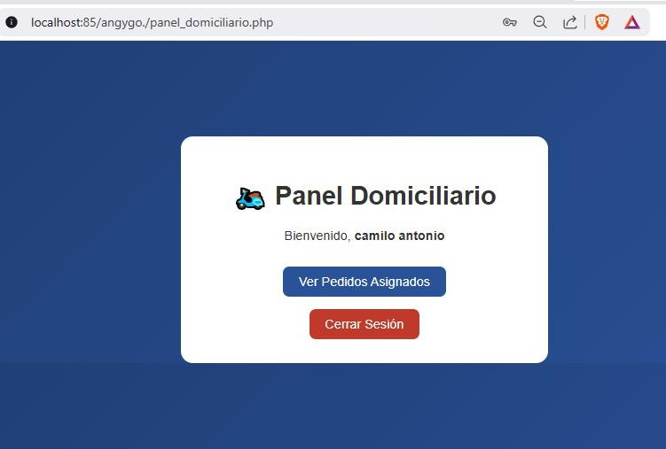
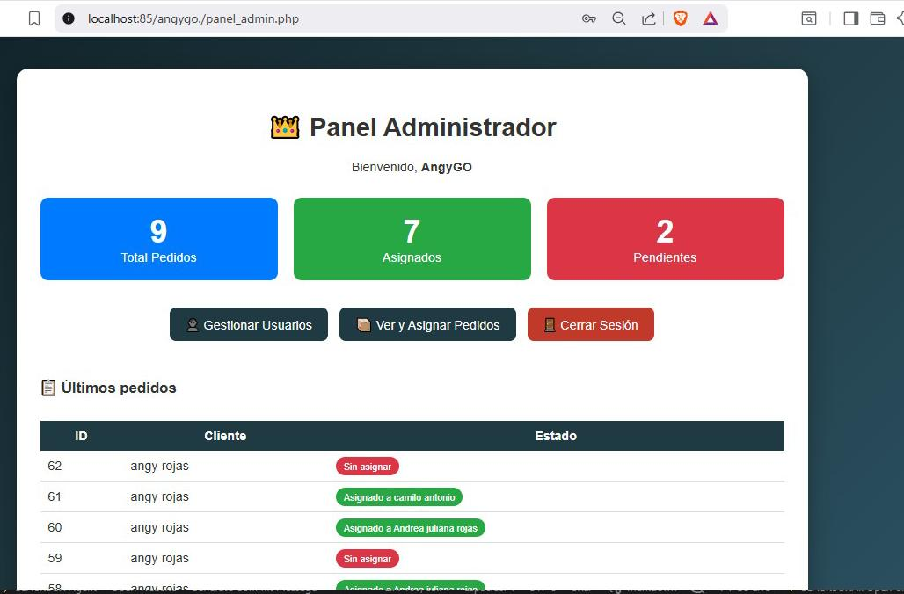

# 🚴‍♂️ AngyGo - Servicio de Domicilios

## 📱 Descripción del Proyecto

**AngyGo** es una aplicación web completa para gestión de servicios de domicilio en Socorro, Santander (Colombia). Permite a clientes realizar pedidos de comida rápida, paquetería y compras express, que se guardan en base de datos y se envían automáticamente por WhatsApp al número del negocio.

Desarrollada con **PHP 8+, MySQL y HTML/CSS/JS puro**. Funciona perfectamente en **XAMPP local** o servidores web compartidos.

**Estado:** ✅ En producción con datos reales (53 pedidos, 9 usuarios).

## ✨ Características Principales

- **🔐 Autenticación completa:**
  - Registro de usuarios con confirmación por email (tokens)
  - Login seguro con `password_hash()`
  - Recuperación de contraseña por email
  - Roles: cliente, admin, domiciliario

- **📦 Gestión de Pedidos:**
  - Formulario intuitivo para clientes
  - Almacenamiento en MySQL (`pedidos` table)
  - Integración automática con **WhatsApp Business**
  - Admin puede ver, asignar a domiciliarios y estadísticas

- **👑 Panel Administrador:**
  - Dashboard con métricas (total, asignados, pendientes)
  - CRUD usuarios (crear/editar/eliminar)
  - Vista y asignación de pedidos
  - Últimos pedidos

- **🛵 Panel Domiciliario:**
  - Ver pedidos asignados
  - Fácil expansión

- **🎨 Interfaz Moderna:**
  - Responsive design
  - Gradientes y animaciones
  - Imágenes optimizadas (logo, servicios)

- **📊 Base de Datos:**
  ```
  - usuarios (id, nombre, correo, password, fecha_registro)
  - pedidos (id, nombre, telefono, direccion, producto, cantidad, comentarios, fecha)
  - email_confirmations & password_resets (tokens seguros)
  ```

## 📸 Capturas de Pantalla

| Cliente (index.php) | Login | Panel Admin |
|--------------------|--------|-------------|
|  |  |  |


## 🛠️ Requisitos Previos

- **XAMPP** (Apache + MySQL) o servidor PHP/MySQL
- **PHP 8.0+**
- **MySQL 5.7+**
- Navegador moderno

## 🚀 Instalación Rápida (5 minutos)

1. **Descarga/Coloca archivos:**
   ```
   c:/xampp/htdocs/AngyGo/
   ```

2. **Inicia XAMPP:**
   ```
   Apache: START
   MySQL: START
   ```

3. **Crea Base de Datos:**
   - Abre `http://localhost/phpmyadmin`
   - Crea DB: `angygo`
   - Importa: `angygo.sql` (incluye datos de prueba)

4. **Configura Conexión (opcional):**
   Edita `conexion.php` si cambias credenciales MySQL:
   ```php
   $servidor = 'localhost';
   $usuario_db = 'root';
   $password_db = ''; // Vacío en XAMPP por defecto
   $nombre_db = 'angygo';
   ```

5. **¡Listo! Abre en navegador:**
   ```
   http://localhost/AngyGo/
   ```

## 👥 Cómo Usar

### 1. **Cliente (Usuario normal)**
```
1. Registro/login en login.php
2. index.php → Llena formulario pedido
3. ¡Se envía por WhatsApp automáticamente!
```

**Demo Usuario:** 
- Email: `andrea09@gmail.com`
- Pass: `123456`

### 2. **Admin**
```
Login → panel_admin.php
- Ver estadísticas
- Gestionar usuarios (gestionar_usuarios.php)
- Ver/asignar pedidos (ver_pedidos_admin.php)
```

**Admin Demo:**
- Email: `shibucai93@gmail.com`
- Pass: `123456` (cambiar en producción)

### 3. **Domiciliario**
```
Login → panel_domiciliario.php → pedidos_asignados.php
```

## 📁 Estructura del Proyecto

```
AngyGo/
├── index.php              # Formulario pedidos cliente
├── login.php             # Autenticación
├── registro.php          # Registro usuarios
├── panel_admin.php       # Dashboard admin
├── panel_domiciliario.php # Panel delivery
├── guardar_pedido.php    # Procesar pedidos
├── conexion.php          # DB connection
├── angygo.sql            # Base de datos
├── imagenAngyGo/         # Assets
└── README.md
```

## 📞 Contacto & WhatsApp

**WhatsApp Negocio:** [+57 304 525 7674](https://wa.me/573045257674)

**Email:** angygo916@gmail.com

**Ubicación:** Socorro - Santander, Colombia

## 🔮 Próximas Mejoras Sugeridas

- [ ] Mapa con Google Maps para direcciones
- [ ] Notificaciones push/email
- [ ] Pagos en línea (PayU/MercadoPago)
- [ ] App móvil (React Native)
- [ ] Panel cliente avanzado (historial pedidos)
- [ ] Asignación inteligente de rutas

## 📄 Licencia

Proyecto SENA 2026 - Uso educativo/comercial con atribución.

---

**¡Gracias por usar AngyGo! 🚀**  
*Desarrollado con ❤️ por el equipo AngyGo*

